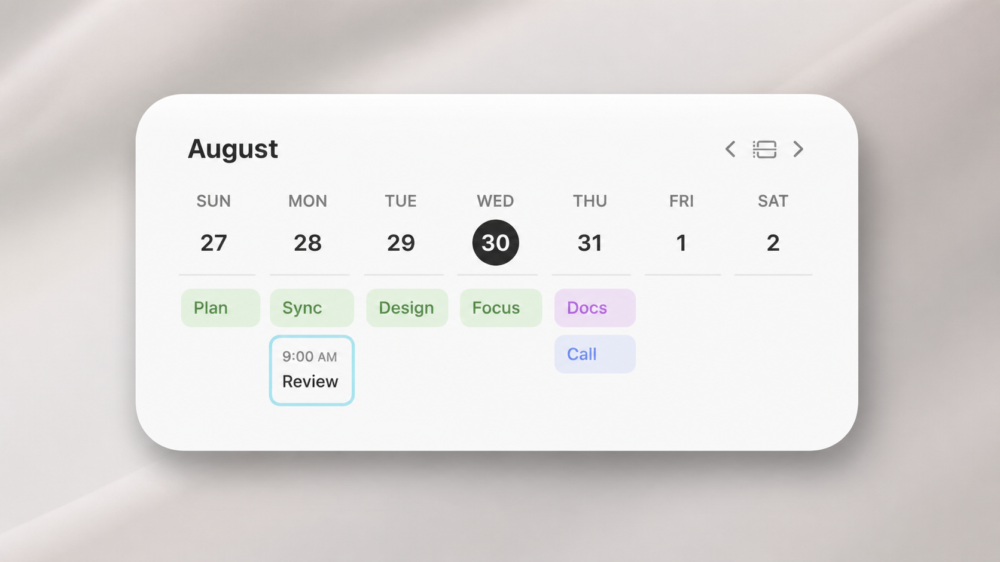

# Calendar Week Widget

A real macOS WidgetKit widget for Apple Calendar that shows selected calendars across a full Sunday-to-Saturday week.

## What It Does

- Companion macOS app requests Apple Calendar permission.
- Calendar visibility syncs from the calendars shown in Apple Calendar.
- The app writes a weekly snapshot into the widget extension's local container for development.
- The widget renders all-day events as filled color chips and timed events as bordered color chips.
- Widget controls can move to the previous week, return to this week, or move to the next week.

## Current WidgetKit Limitation

WidgetKit widgets are timeline snapshots. This widget supports previous/next week buttons, but it cannot freely scroll like a full app view.

## Local Configuration

This project uses `Config/Local.xcconfig` like a local `.env` file. It is ignored by git.

1. Copy `Config/Local.xcconfig.example` to `Config/Local.xcconfig`.
2. Fill in:
   - `CALENDAR_WEEK_DEVELOPMENT_TEAM`: your Apple Team ID from Xcode.
   - `CALENDAR_WEEK_APP_BUNDLE_ID`: a unique app bundle id, such as `com.yourname.calendarweek`.
   - `CALENDAR_WEEK_WIDGET_BUNDLE_ID`: usually `$(CALENDAR_WEEK_APP_BUNDLE_ID).widget`.
   - `CALENDAR_WEEK_URL_SCHEME`: a unique URL scheme, such as `calendarweek-yourname`.

For development, each person should use their own bundle identifiers. Do not reuse someone else's `com.*` identifiers when publishing or sharing builds.

## Build

1. Open `MacCalendarWeek.xcodeproj` in Xcode.
2. Create `Config/Local.xcconfig` from the example file and fill in your values.
3. Build and run the `MacCalendarWeek` app.
4. Grant Calendar permission and click **Refresh Widget Events**.
5. Add the **Calendar Week** widget from macOS widget editing.

## Privacy Notes

Calendar event titles and dates are private user data. The app keeps its generated widget snapshot on the local Mac and does not upload calendar data anywhere. Avoid committing generated snapshots, DerivedData, build products, logs, or screenshots that reveal real events.

The current development build mirrors Apple Calendar's visible calendars by reading Calendar's local preferences. That is useful for local use, but it is not a public EventKit API and could change in future macOS versions.
